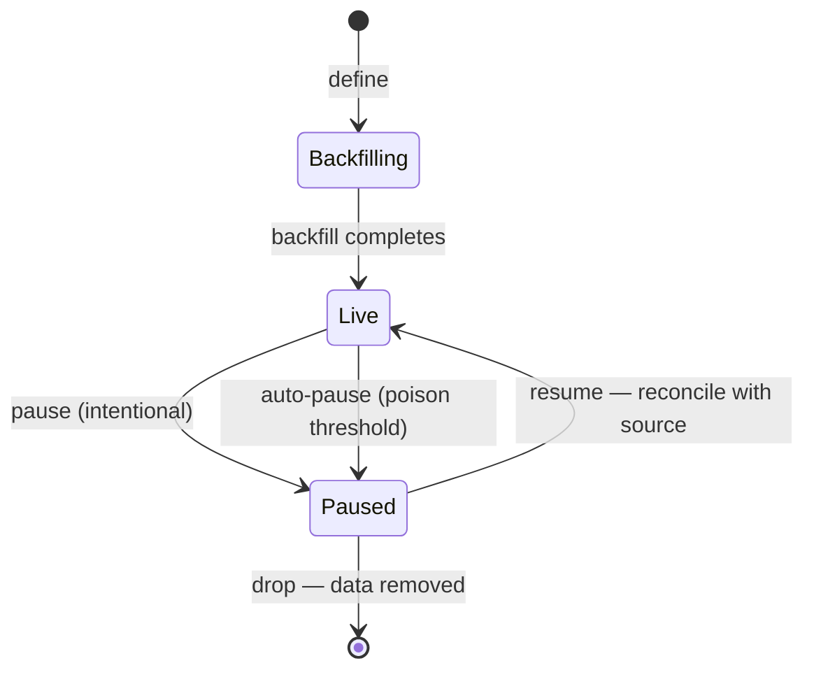

# Pausing and Dropping a Definition

Defining derived state is only half a lifecycle. A definition — a transform or a
relationship — can also need to stop: frozen while an operator investigates or stages
a schema change, or removed entirely. This ADR settles that other half. Pause and drop
apply to any definition uniformly; the act of defining is one concept, and so is its
inverse.

## The lifecycle

A live definition reaches `Paused` two ways that share one state: an operator pauses it
deliberately, or the engine auto-pauses it when a target accumulates too many poisoned
rows. Both stop the claim-time fold from writing to the target and hold its current,
now-stale value. From `Paused`, an operator either resumes — which reconciles the target
with current source data — or drops it, which removes the definition and its data.

Drop acts only on a paused definition. There is no direct live-to-gone edge: quiescing
first is a precondition, so the removal never has to reason about a fold still
dispatching to the target.

## Decisions

### Pause is one state with two triggers

Intentional pause and automatic poison-driven pause are the same state, reached by the
same status gate the fold already honors. There is no second freezing mechanism. An
operator pause is durable until an explicit resume; a poison auto-pause is durable until
the operator addresses the poisoned rows and resumes. Column-level quarantine is this
same idea at column granularity — a paused column holds a deliberately stale value while
the rest of the target stays live.

### Resume reconciles with source, not by catch-up

A paused definition must not pin the staging ring. Holding ring segments open for a
paused target would wedge the ring for every other definition reading the same source.
So while a definition is paused, its share of the change stream is drained for its
siblings and is not recoverable by replay.

Resume therefore reconciles the target with current source data rather than catching up
over buffered changes, because there are none. The target is not cleared and rebuilt.
Readers keep seeing its rows throughout, and the reconciliation has two halves, committed
together in one transaction (issue #330):

- Every target row that no current source row backs is deleted. That covers a 1-1 row
  whose source row was deleted, and an aggregate group whose rows were all deleted or,
  through a relationship-path `GROUP BY` key, all moved to other groups.
- Every current source row is enumerated for the drain to re-derive, the same
  enumeration a new definition's catch-up runs.

Deletions are visible the moment that transaction commits. Rows whose values changed
during the pause stay stale until the drain re-derives them, and rows the source gained
appear the same way. The deletes go through the target-mutation seam like any other
target write, so a live definition reading this target drops them too.

A long pause is not free: the cost of resuming scales with the data, not with the length
of the pause. This is the contract, stated so a caller does not expect a cheap resume.

### Drop always removes the associated data

Dropping a definition drops its target table; dropping a single derived column drops
that column's data. There is no option to retire the definition while keeping the data —
a caller who wants the derived data to persist without being maintained leaves the
definition paused. Keeping the derived rows after removing the definition that explains
them has no use we can name, and the paused state already serves it.

Because the target table and its columns are Trellis-owned, dropping them is Trellis's
to do. Source tables remain user-owned and untouched.

### Drops go in reverse dependency order — no cascade

If any definition still chains off the target being dropped, the drop is refused and names
the definitions that depend on it. Trellis does not cascade the removal, and does not
leave a dependent silently deriving from a table that is about to disappear. The operator
retires dependents first. The refusal names them so the order to follow is explicit.

A dependent blocks whatever its status — being registered at all is enough. A dependent
mid-backfill is reading the target right now; a paused one is worse, because resume
reconciles it against its source, so a dependent frozen over a dropped source can never be
resumed. Only a fully retired dependent stops blocking. Reverse dependency order
therefore means *dropping* the dependents first, not merely pausing them.

### In-flight work is quiesced by the pause, never by deleting shared state

Only per-definition backfill work is keyed to the definition and removed with it; a chunk
a drain worker holds is released on its own heartbeat. Everything else that in-flight work
touches — ring segments, claims, the poison band — is keyed to the *source* table and
co-owned by every definition reading it. A drop never deletes that shared state out from
under a running worker. The pause is what makes this safe: once paused, the fold no longer
dispatches to the target, so a batch still draining for the source skips it while its
siblings continue, and the drop then removes only what the target itself owns.

### Quarantine state follows its owner

Target-keyed quarantine bookkeeping — the per-column status a target accumulates — is
dropped with the target; its forensic value goes with the data. The whole-key poison band
is keyed to the source table and shared with sibling definitions, so a drop leaves it
untouched.

### The publication shrinks by reconciliation

A drop does not hand-edit the replication publication. After removing the definition it
reconciles the publication against the definitions that remain, which removes a source
table from replication only when nothing derives from it any longer. Correct by
construction, and applied at drop time rather than deferred to a maintenance pass.

> [ADR-0016](0016-single-background-capture-path.md) moves this reconcile to the
> staging worker's maintenance pass, since only the staging worker changes the
> publication. The reconciliation itself is unchanged. Not yet implemented.

### Pause and drop are idempotent

Defining runs on Trellis's own connections, not inside a host application's migration
transaction, and so does its inverse. A migration that is replayed or rolled back must be
safe in both directions, so pausing an already-paused definition and dropping an absent
one are no-op successes. The two states a caller can be uncertain about — "did the pause
land?", "is it already gone?" — resolve to success, not error.

### Pause, resume, and drop are grammar, entered through the one facade entrypoint

They are not separate typed methods and not staging internals reached around with SQL.
Each is a statement in Trellis's grammar, submitted through the single definition
entrypoint the facade exposes — the same entrypoint and grammar that define a transform
or a relationship, the same text the CLI speaks. The engine parses the statement to
decide the operation and composes it behind the facade, returning plain data.

## Consequences

- Every definition has a reversible freeze and a terminal removal. The freeze holds stale
  data; the removal takes the data with it.
- A long pause costs a full re-enumeration of the source to resume, because the change
  stream is drained for siblings while paused.
- Removal is safe under load: it quiesces through the pause and touches only
  definition-owned rows, never shared source-keyed staging or poison state.
- A framework migration's rollback is honest: pause-then-drop, idempotent in both
  directions, even though it does not share the host's migration transaction.
