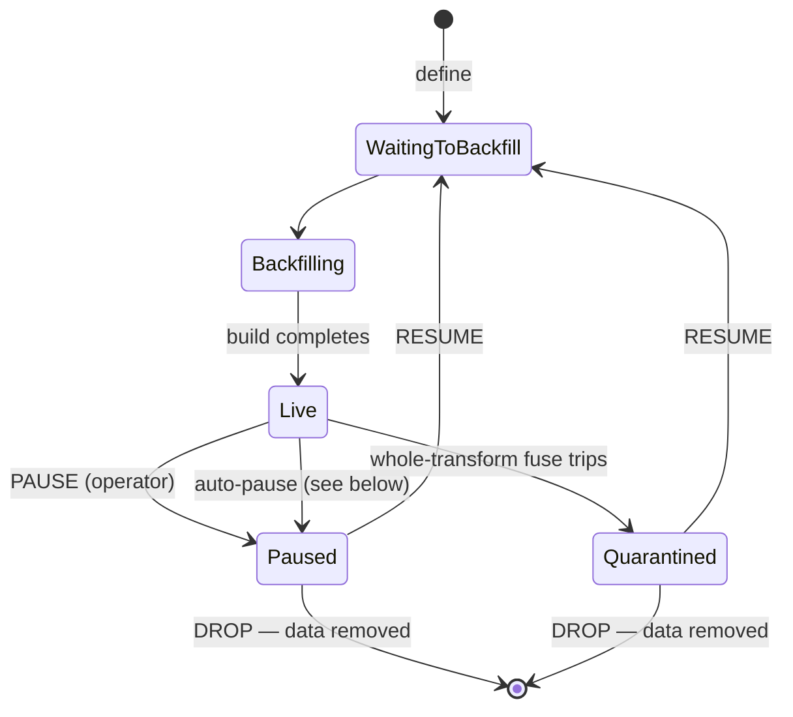

# Pausing and Dropping a Definition

Defining derived state is only half a lifecycle. A definition — a transform or a
relationship — can also need to stop: frozen while an operator investigates or stages
a schema change, or removed entirely. This ADR settles that other half. Drop applies to
any definition uniformly; pause applies to transforms, the only definitions with a status.

## The lifecycle

```mermaid
stateDiagram-v2
    [*] --> WaitingToBackfill: define
    WaitingToBackfill --> Backfilling
    Backfilling --> Live: build completes
    Live --> Paused: PAUSE (operator)
    Live --> Paused: auto-pause (see below)
    Live --> Quarantined: whole-transform fuse trips
    Paused --> WaitingToBackfill: RESUME
    Quarantined --> WaitingToBackfill: RESUME
    Paused --> [*]: DROP — data removed
    Quarantined --> [*]: DROP — data removed
```

A definition is frozen in one of two statuses, and both stop the claim-time fold from
writing to the target and hold its current, now-stale value. `paused` is reached by an
operator's `PAUSE`, or by the engine when it cannot maintain the definition:

- **Capture failure.** A column the definition reads was renamed or dropped, or its
  source's primary key was redefined, or row-level security came to apply to the Trellis
  role on a table it reads or on its target, or a logical-replication subscription began
  replicating into a table it reads. The reason is on the status's `capture_failure`.
- **Repeated build failure.** A build chunk kept failing in a way no retry or narrowing
  gets past (a missing table or column, say). The error stays on `backfill_failure`.
- **A halting drain failure.** A failure every key reproduces (a source with no usable
  primary key, a propagation wave past the hop bound, an aggregate target off its ledger)
  pauses every definition it reaches and everything downstream of them, so the rest of the
  page commits instead of retrying forever. Recorded on `capture_failure`.

`quarantined` is the whole-transform poison fuse ([ADR-0003](0003-quarantine-storage-and-api.md)):
too many poisoned source rows. It is a separate status so that poison incidents stay
distinguishable from an operator's pause. From either, an operator resumes, which
reconciles the target with current source data, or drops it, which removes the
definition and its data. Every freeze stays until an operator acts.

Drop acts only on a frozen definition (`paused` or `quarantined`). There is no direct
live-to-gone edge: quiescing first is a precondition, so the removal never has to reason
about a fold still dispatching to the target. Only a transform can be paused; a
relationship has no status to freeze, and is dropped outright once nothing reads it.

## Decisions

### Pause is one freeze with several triggers

An operator pause, an engine auto-pause and the poison fuse all freeze a definition by
the same status gate the fold already honors. There is no second freezing mechanism. A
freeze is durable until an explicit resume. Column-level quarantine is this same idea at
column granularity: a paused column holds a deliberately stale value while the rest of
the target stays live. A column pause freezes the column from the moment it returns. It
bumps its source's version fence, so a drain page or build chunk that planned the column
as live either commits before the pause does or finds the fence moved and plans again
without it. The pause then cascades to the column's readers, each fenced the same way in
a transaction of its own. If a reader's fence bump waits out the lock timeout, the pause
returns the error and stays marked as owing its cascade, and the staging worker's capture
pass finishes the cascade. A definition defined, or a field added, while a column it
reads is paused is paused at birth, and that column's resume releases it.

### Resume reconciles with source, not by catch-up

A paused definition must not pin the staging ring. Holding ring segments open for a
paused target would wedge the ring for every other definition reading the same source.
So while a definition is paused, its share of the change stream is drained for its
siblings and is not recoverable by replay.

Resume therefore reconciles the target with current source data rather than catching up
over buffered changes, because there are none. The target is not cleared and rebuilt.
Readers keep seeing its rows throughout, and the reconciliation has two halves, committed
together in one transaction (issue #330) and read on one snapshot (issue #436):

- Every target row that no current source row backs is deleted. That covers a 1-1 row
  whose source row was deleted, and an aggregate group whose rows were all deleted or,
  through a relationship-path `GROUP BY` key, all moved to other groups.
- Every current source row is re-derived, by whichever build the definition
  qualifies for. A definition the Re-derive build serves restarts it over the
  existing ledger entries, and its sweep re-derives each live entry no chunk
  reached (a key deleted while frozen). Any other definition parks a marker,
  and its one-pass build ends in a go-live catch-up that enumerates the
  source's current keys as image-less Recomputes, plus the orphan sweep
  (`intake::resume_orphans`) above. An aggregate's one-pass build rebuilds
  its ledger, and before it applies again it deletes every group the rebuilt
  ledger has no live entry for: a group whose rows left after the sweep's
  snapshot but before the build's read. `RESUME` first bumps the source's
  version fence and discards the definition's unclaimed backfill chunks.

Deletions are visible the moment that transaction commits. Rows whose values changed
during the pause stay stale until the drain re-derives them, and rows the source gained
appear the same way. The deletes, the build's included, go through the target-mutation
seam like any other target write, so a live definition reading this target drops them too.

Before any of that, resume re-validates the definition against the live schema, with
the same checks define runs (`defs::catalog::revalidate`): its fields over the source's
live columns, the source key's type and collations, each relationship it reads
through (both join columns still on the allowlist and still the same type, modifier
and collation), row-level security and subscriptions, and, for a 1-1 definition, a
source key that is still the one its target is keyed by. While define would refuse
it, the resume refuses with define's error, names the column and what to change, and
changes nothing: the definition stays paused. A field resume runs the same check on
its definition, and leaves a dependent its cascade reaches paused while that
dependent's check fails.

A resume then rebuilds from the schema as it is now. It records the source's live
column types, which the rebuild casts through, and the type of each column the
definition keys by (`definition_key_types`), which the staging worker's capture pass
compares later changes against. The pass records a key column's new type itself when it
accepts a change to it without a pause. And the resume brings every column Trellis
created for the definition with a type that comes from the source to the type define
would give it now. Some are copies of one source column: a 1-1 target's key and
passthrough columns, an aggregate's `GROUP BY` columns in its target, ledger and
group-delta table, and a to-one relationship projection's key and its column for each
to-side column read through the relationship. Others are typed by an expression, and
take the type define's inference gives it over the live schema: a 1-1 target's
calculated fields, an aggregate's field columns (`SUM(qty)` is `bigint` over an
`integer` `qty` and `numeric` over a `bigint` one), and its ledger's contribution
columns, typed as the aggregate's argument. The staging worker's capture pass pauses a
definition when the source widens past one of these columns, and the resume re-types
every one whose type differs from define's, whichever change made it differ. Re-typing
one is an `ALTER … TYPE` under `ACCESS EXCLUSIVE`, which waits for every reader of the
table and, for `integer` to `bigint`, rewrites it, so it never runs inside `RESUME`: a
resume with columns to re-type records a request (`resume_requests`) and returns at
once, the definition still paused, and the staging worker's next capture pass re-types
them, one table per transaction, then runs the resume itself. A crash between the two
leaves the request, and the next pass (or the next `RESUME`) finishes the work. So does
a table whose re-type fails transiently (a lock it can't get in time, a deadlock, a
serialization failure, a cancelled statement, a lost connection): the request stays,
and the next pass tries again. A column whose re-type fails otherwise (a value its new
type can't hold) ends the request with the error on the definition's
`capture_failure`, and leaves that table's columns as they were; another table's,
re-typed before it, keep their new types, and the next resume finds them current. The target keeps its rows. When its values can't be converted (a key
moved from `text` to `uuid` by a `USING` that isn't a cast), the error names the repair:
`DROP TRANSFORM` and define the definition again, which builds the target from empty.
Trellis doesn't empty the target itself, because the application reads it: emptying it
is the operator's call. The resume always rebuilds after it re-types. Each re-type keeps
the column's collation.

A resume that re-types a definition's target can pause the definitions chained off it,
when a column Trellis created for one of them, typed from the target's column, no longer
has the type define would give it. The re-type's transaction records which definition's
resume re-typed each target column (`retype_causes`). When the capture pass pauses a
chained definition only for columns that resume re-typed, the pause records the upstream
definition as its cause (`capture_failures.caused_by`), and the `capture_failure` names
the upstream resume rather than a column the operator never altered. It says to resume
the chained definition once the upstream is live again, since its rebuild reads the
upstream's target. That resume re-types the chained definition's own target in turn, and
the next definition down records it as its cause. Following the causes down from a
definition finds every definition its resume paused, one level per resume. A chained
definition the re-type leaves refused, failing its own re-validation (a relationship's join
columns no longer match), keeps its own error and records no cause. So does one already
paused for another reason, by the operator or by quarantine.

Outside a resume, Trellis re-types a column on its own in one case: when every column
of a table it created that the source widened widened by changing only the catalog.
Exactly four widenings qualify: `varchar(n)` to a longer `varchar(m)`, `varchar(n)` or
`varchar` to `text`, `varchar(n)` to `varchar`, and `numeric(p,s)` to a larger
precision at the same scale. Postgres rewrites nothing for them, changes no value and
keeps every index. The capture pass then re-types that table's columns itself, one
table per transaction, under the same lock timeout as a resume's re-type, and nothing
pauses or rebuilds, a `varchar` key's copy included. The pass records the key's new
type, as a resume would. Its `ALTER` is the transaction's first statement, so it
waits for the table's `ACCESS EXCLUSIVE` holding no other lock, and once it has the
table it takes the locks of the table's own indexes and TOAST table, and of any
object of the application's that depends on the column, such as a foreign key that
references it. Trellis's own pages, builds and releases take nothing it waits on, so
it can't close a lock cycle with them: a page queued behind it waits at most the
timeout. A cycle through an application object ends in a deadlock error, which counts
as transient. A table whose re-type fails transiently (its lock not got
in time, a deadlock, a statement timeout) is left as it is, nothing pauses, and the
next pass tries again. A table where some widened column needs a rewrite pauses its
definitions as above, and so does one whose re-type fails otherwise while some column
there outgrew its type. One whose columns all still hold every value (`varchar` to
`text`) keeps its old types and pauses nothing, since its writes still succeed. The
worker doesn't retry a re-type that failed otherwise until the source's type changes
again, a definition with a column on the table is defined or dropped, or the worker
restarts, so it doesn't take the table's lock every pass.

A value written between the source's `ALTER` and that re-type fails its write (`22001`
or `22003`), and its key may be held. One whose characters past the old `varchar`
length are all spaces is stored truncated instead, and stays so ([known correctness
gaps, entry 23](../known-correctness-gaps.md#23-a-value-padded-with-spaces-past-a-widened-varchars-old-length-drained-before-trellis-re-types-its-copy)).
The re-type's transaction records a release request for each definition with a column
on the table (`retype_releases`).
After the pass, the staging worker releases each key such a definition holds whose
failure had that SQLSTATE, recorded on its `poison` row, one key at a time through the
same release as `Trellis::release_key`, and the key's parked work is applied again. It
does so again after each pass for twice the session lock timeout, so a key whose
eviction reproduced its failure before the re-type but committed after the release read
the held keys is released too. A key held for any other failure stays held.

Resume also releases every key the definition holds in quarantine: it deletes the
definition's own `poison`, `poison_held` and `key_deaths` rows in the same transaction.
The re-derivation covers every key from the source, so the parked work is superseded
rather than replayed, and a key whose cause is still there fails again and is quarantined
again. Whole-key poison is per transform, so every other definition's held keys are
untouched
([ADR-0003](0003-quarantine-storage-and-api.md#releasing-held-keys)).

A long pause is not free: the cost of resuming scales with the data, not with the length
of the pause. This is the contract, stated so a caller does not expect a cheap resume.

### Drop always removes the associated data

Dropping a definition drops its target table; dropping a single derived column drops
that column's data. There is no option to retire the definition while keeping the data —
a caller who wants the derived data to persist without being maintained leaves the
definition paused. Keeping the derived rows after removing the definition that explains
them has no use we can name, and the paused state already serves it.

Because the target table and its columns are Trellis-owned, dropping them is Trellis's
to do. Source tables remain user-owned and untouched. That ownership holds because
registration only ever creates a target table: it refuses a transform whose target name
already names any relation (#440), so a table Trellis later drops is always one it created.

### Drops go in reverse dependency order — no cascade

If any definition still chains off the target being dropped, the drop is refused and names
the definitions that depend on it. Trellis does not cascade the removal, and does not
leave a dependent silently deriving from a table that is about to disappear. The operator
retires dependents first. The refusal names them so the order to follow is explicit.

A dependent blocks whatever its status — being registered at all is enough. A dependent
mid-backfill is reading the target right now; a paused one is worse, because resume
reconciles it against its source, so a dependent frozen over a dropped source can never be
resumed. Only a fully retired dependent stops blocking. Reverse dependency order
therefore means *dropping* the dependents first, not merely pausing them.

### In-flight work is quiesced by the pause, never by deleting shared state

Only per-definition backfill work is keyed to the definition and removed with it; a chunk
a drain worker holds is released on its own heartbeat. Everything else that in-flight work
touches — ring segments and claims — is keyed to the *source* table and co-owned by every
definition reading it, and each sibling definition's quarantine is its own. A drop never
deletes that state out from under a running worker. The pause is what makes this safe: once paused, the fold no longer
dispatches to the target, so a batch still draining for the source skips it while its
siblings continue, and the drop then removes only what the target itself owns.

### Quarantine state follows its owner

Target-keyed quarantine bookkeeping — the per-column status a target accumulates — is
dropped with the target; its forensic value goes with the data. The whole-key poison band
is per definition too (`poison`, `poison_held` and `key_deaths` carry the definition's id),
and goes with the definition row by `on delete cascade`, so a definition defined again
starts with no held keys. A sibling definition on the same source keeps its own.

### Capture shrinks by reconciliation

A drop does not touch the source table. It removes the definition's catalog rows, and
the staging worker's reconcile pass, which derives what to capture from the catalog every
`reconcile_interval`, uninstalls a source table's capture triggers once nothing reads it
any longer. A table a sibling definition still reads stays captured. Correct by
construction, with the catalog as the only input.

The uninstall is deferred to that pass rather than applied at drop time
([ADR-0002](0002-async-data-flow.md#capture-by-statement-triggers)): the staging worker
is the only process that changes a source table's triggers, so dropping a transform
needs no privileges on the source. The cost is that the table's changes keep being
staged for up to one `reconcile_interval` with no reader, which is harmless, because
apply skips a table nothing reads.

### Pause and drop are idempotent

Defining runs on Trellis's own connections, not inside a host application's migration
transaction, and so does its inverse. A migration that is replayed or rolled back must be
safe in both directions, so pausing an already-paused definition and dropping an absent
one are no-op successes. The two states a caller can be uncertain about — "did the pause
land?", "is it already gone?" — resolve to success, not error.

### Pause, resume, and drop are grammar, entered through the one facade entrypoint

They are not separate typed methods and not staging internals reached around with SQL.
Each is a statement in Trellis's grammar, submitted through the single definition
entrypoint the facade exposes — the same entrypoint and grammar that define a transform
or a relationship, the same text the CLI speaks. The engine parses the statement to
decide the operation and composes it behind the facade, returning plain data.

## Consequences

- Every definition has a reversible freeze and a terminal removal. The freeze holds stale
  data; the removal takes the data with it.
- A long pause costs a full re-enumeration of the source to resume, because the change
  stream is drained for siblings while paused.
- Removal is safe under load: it quiesces through the pause and touches only
  definition-owned rows, never shared source-keyed staging state or a sibling's poison.
- A framework migration's rollback is honest: pause-then-drop, idempotent in both
  directions, even though it does not share the host's migration transaction.
