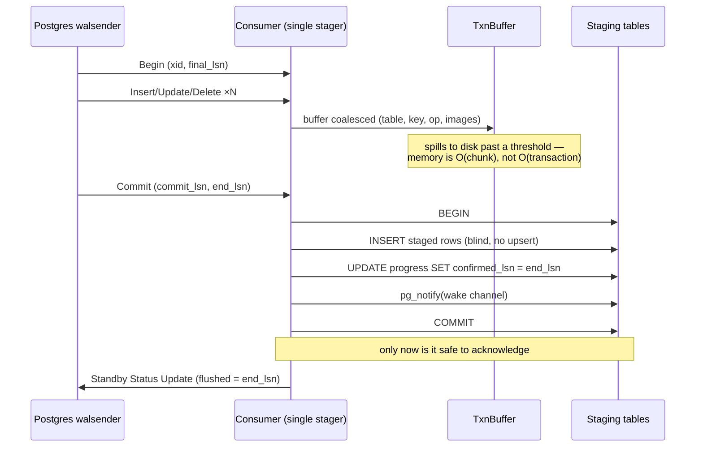

# Stage 1 — Logical replication into the staging area, and the acknowledgment

← [Overview](README.md) · next → [The staging ring](02-the-staging-ring.md)

**What this stage owns:** turning a committed source change into a durable row in
the staging area, and only then telling the upstream cursor it may move.

**The guarantee:** *the replication slot's confirmed position never exceeds work
that is durably staged.* A crash at any instant either loses nothing or replays
work that was never staged — there is no third outcome.

## The pipeline



## The intake unit

Trellis reduces every decoded change to `(table, primary_key, op, lsn)` plus the
old and new row images. That is why it tolerates a lossy decoder: the apply half
**re-reads current source state and recomputes**, so the classic logical-decoding
footguns — TOAST columns omitted from an update, partial old-row images — never
reach the derived values.

The exception is the old image, which *cannot* be re-read once the row is gone:

- A **child row deleted** from a one-to-many aggregate: only the old foreign key
  identifies which parent group to refresh.
- A **re-parented row**: both old and new parent groups must be refreshed, and
  only the old image names the old one.

Postgres logs only the old tuple's primary key by default, so those tables need
`REPLICA IDENTITY FULL`. Trellis treats that as a **checked user requirement**:
a definition that needs it is rejected with the exact `ALTER TABLE` in the error
text — issuing DDL against tables it does not own would turn a library into an
operator.

## The linchpin: stage and watermark in one transaction

The entire stage is three lines:

```sql
BEGIN;
  INSERT INTO <active ring table> (...) VALUES (...), (...), ...;   -- blind, no ON CONFLICT
  UPDATE replication_progress
     SET confirmed_lsn = :end_lsn
   WHERE slot_name = :slot AND confirmed_lsn < :end_lsn;            -- monotonic
  SELECT pg_notify(:wake_channel, '');                              -- transactional
COMMIT;
```

**Only after that `COMMIT` returns** does the consumer send the Standby Status
Update reporting `end_lsn` as flushed. Four details are each load-bearing:

- **One transaction.** If staging and the watermark could commit separately, a
  crash in between leaves a watermark ahead of the staged rows, and the changes in
  the gap are in no stream and staged by nothing — permanent, silent loss.
- **Acknowledgment is after the commit, not inside it.** The in-memory
  `confirmed` value is advanced only *after* the commit returns. If staging fails,
  `confirmed` is untouched, the slot stays put, and Postgres replays the whole
  transaction.
- **Replay is safe because the failed attempt left nothing** — not because a
  re-stage would deduplicate. The ring is append-only with no upsert on this path,
  and re-staging duplicate rows *would* duplicate them. Because the stage
  transaction is all-or-nothing, replay restarts from the first attempt's starting
  state. A partial-commit path would instead force deduplication at write time —
  the thing this design deliberately lacks (see
  [04](04-claiming-and-the-fold.md)).
- **`NOTIFY` is inside the transaction** so listeners wake only once staged rows
  are visible. It is a latency optimization only; the poll interval is the
  correctness fallback, since a pooler or a dropped connection can lose a
  notification.

**Which LSN to confirm.** Trellis confirms `end_lsn` (the position *after* the
commit record), not `commit_lsn`. Both are safe — confirming lower only causes
harmless re-delivery — but `end_lsn` is what the streaming protocol expects a
standby to report as flushed, and it lets a clean resume re-stream nothing.

## Why not confirm on *apply* instead?

Confirming only once derived results are written is the obvious first design. It
was rejected because it **couples the cursor to the slowest consumer**: WAL
retention would grow whenever compute falls behind, which is the normal case under
a burst. A stalled consumer that pins WAL can take down the primary — the dominant
operational hazard of logical replication — and it must not be reachable through
ordinary backlog. Decoupling also enables claim-time coalescing
([04](04-claiming-and-the-fold.md)). The cost is one extra hop, in exchange for
intake throughput independent of compute throughput.

## Bounding memory: the whole-transaction problem

Confirm-after-stage means the consumer must hold a transaction's changes until its
Commit arrives, so intake memory is naïvely proportional to the largest single
source transaction — and one `UPDATE big SET …`, a large `COPY`, or a migration can
be multiple gigabytes, especially under `REPLICA IDENTITY FULL`.

Trellis's answer is a **bounded in-memory head that spills to an append-only temp
file** past a threshold (default 256k keys). At Commit the spill file streams back
into the *single* staging transaction, so the linchpin is unchanged: memory is
O(chunk), not O(transaction). A hard cap (default 5M keys) fails with an error
**naming the xid and tables** — a diagnosable stall rather than an opaque OOM
crash-loop.

Two consequences:

- **Cross-chunk coalescing is not attempted during staging.** Two chunks' rows for
  one key both land, and the claim-time fold collapses them
  ([04](04-claiming-and-the-fold.md)); the streamed result is identical to the
  buffered result. Designing the fold as the *only* place merging happens is what
  makes the spill path provably equivalent.
- **The spill file is a stopgap.** The structural fix is the protocol's own
  streaming mode (`pgoutput` v2), where the server streams large transactions in
  chunks *before* commit; intake stages chunks provisionally in a side table keyed
  by xid, folds them on Stream Commit, and discards on Stream Abort. Where the
  server supports it (PostgreSQL 14+), Trellis builds the streaming path and skips
  the spill file entirely.

## The quiet-stream problem

A stream carrying no watched changes still needs the watermark to advance, so a
caller waiting on a token converges and Postgres can recycle WAL. Trellis advances
the persisted watermark to the server's send position on keepalive frames, with
knife-edged guards:

- **Never mid-transaction.** A keepalive's `wal_end` can sit past the commit record
  of a partially buffered transaction; advancing there confirms WAL whose changes
  were never staged — silent loss on resume.
- **Never regress**, in both the in-memory comparison and the SQL
  `WHERE confirmed_lsn < :new` guard.
- **Persist before reporting.** The durable watermark is written before the
  in-memory value the slot is told about, so a crash in between leaves the table
  ahead of the slot — a harmless re-stream, never a gap.
- **Rate-limit it.** The persist is itself a WAL-generating write; unthrottled, it
  loops on its own writes on servers that echo empty transactions.

## Failure modes

| Failure | Result | Recovery |
|---|---|---|
| crash before the stage commit | nothing staged, slot unmoved | server replays the whole transaction |
| crash between stage commit and the acknowledgment | staged, slot unmoved | server replays; **the replay re-stages duplicate rows**, which the fold collapses per key. This is the one at-least-once seam, and why the fold's merge rules must be idempotent under duplication ([04](04-claiming-and-the-fold.md)) |
| stage transaction fails | rollback, watermark untouched | consumer errors out; next connection resumes at the old position |
| slot invalidated (retention cap exceeded; on a standby, a recovery conflict; on PG18, the idle timeout) | changes between the old confirmed position and any new slot are unrecoverable, so every target the slot fed is stale | at the next staging-worker start Trellis **pauses every transform the slot fed** (directly or through a chain), recreates the slot and keeps running. It logs the slot, the lost position and the paused transforms, and repeats that about once a minute until each is resumed. Nothing resumes automatically: the operator runs `RESUME TRANSFORM` per transform, which rebuilds it by a fresh backfill. Recreating the slot alone would lose the gap |
| slot lost on failover (pre-PG-17), or the source database restored from a backup | same shape as above | same as above. The pause holds until the operator has finished the recovery and chooses when, and in what order, to rebuild |
| slot dropped and recreated under the same name while Trellis was down | same shape as above, even though the slot exists and isn't marked lost | same as above. Trellis spots it by position: it acknowledges a position only after persisting it, so the slot it has been feeding never sits past the persisted position, and a recreated slot always starts past it. A slot another consumer advanced looks the same, and that is a real gap too |
| decoder wedge (server-side decode bug) | walsender dies before a byte arrives; reconnecting dies at the same record | unreachable from the client — name the condition instead of retrying forever |

## Adjacent invariants that are easy to miss

- **`synchronous_commit = on` is a correctness requirement, not tuning.** With it
  off, async-commit WAL is not flushed by the time a watermark catch-up runs, and
  derived values never converge. Trellis refuses a session whose default is `off`
  at connect; a per-session `off` inside the *application's* own connections stays
  a documented requirement.
- **Never drop and recreate the publication** to change its table set. A teardown
  orphans the slot's retention, and rows written between the teardown and the new
  slot's consistent point are in no stream and staged by nothing. Reconcile in
  place with `ALTER PUBLICATION … ADD/DROP TABLE`.
- **Adding a table to the publication needs a durable follow-up.** Its pre-existing
  rows are not in the stream, so they must be staged by enumeration — and that
  enumeration must be as durable as the `ALTER`. Trellis commits the `ALTER` and a
  `pending_backfill` marker in one transaction, deletes the marker in the same
  transaction as the staging commit, and retries it on every setup pass. The marker
  carries a **transaction fence** so enumeration waits until every transaction in
  flight at `ADD` time has settled. A fence taken inside the `ALTER`'s
  transaction falls slightly short — a writer that starts between the fence and
  the commit is neither covered nor streamed — so the discharge re-fences a
  marker the first time it sees it, at a snapshot that postdates the commit
  ([ADR-0016](../decisions/0016-single-background-capture-path.md#the-join-fence);
  *Planned, #431*). This discharge is the **only** capture path:
  every definition's initial build, resume and catch-up reads its source through
  it, and registration reads nothing
  ([data-flow](../data-flow.md#capturing-a-tables-existing-rows)). Only the
  staging worker runs the `ALTER`, including the shrink after a `DROP`: a `DROP`
  removes catalog rows and the worker's reconcile pass takes the table back out
  ([ADR-0016](../decisions/0016-single-background-capture-path.md#consequences);
  *Planned, #427*). The inventory in
  [ADR-0016](../decisions/0016-single-background-capture-path.md#inventory-of-capture-paths)
  lists every capture path and its role.
- **A marker is deleted only by the discharge that read it.** A table has one
  marker, and the catch-ups that park one (a direct build going live, a column
  resume, `ALTER TRANSFORM`) can land while that table's marker is mid-discharge,
  after its enumeration snapshot is already fixed. Each park gives the marker a new
  `generation` (keeping the later of the two fences), and discharge deletes only the
  generation it read, skipping a row a park still has locked. The re-parked marker
  survives for the next pass, whose snapshot includes the park's commit (issues
  #311, #367).
- **That enumeration overlaps the stream, so it must not get ahead of intake.** A
  change committed after the `ADD` but before the enumeration is both streamed and
  enumerated. The enumeration's image-less `Recompute` makes an aggregate re-derive
  the group from live state, so if it drains before that change's CDC delta, the
  delta counts the change a second time (issue #312). The enumeration therefore
  captures `pg_current_wal_insert_lsn()` right after declaring its cursor and does
  not append until intake's staged-through watermark reaches it, which puts every
  overlapping delta in the same batch as the recompute or an earlier one. That
  ordering alone is not enough, because batches drain out of order and in
  parallel: what actually prevents the double count is the aggregate recompute
  horizon ([05](05-apply-and-exactly-once-deltas.md#aggregate-groups-the-recompute-horizon),
  issue #321). The wait only makes the resulting re-derivations rarer. The
  discharge runs only once intake is running, so setup leaves every marker to
  the maintenance loop, for a fresh slot and an existing one alike.
- **Trellis's own writes to a target never stream at all.** A chain's
  intermediate hop is a target Trellis writes and a source a downstream
  transform reads. It stays out of the publication (issue #315): every write to
  a target stages its downstream `Recompute` inside the writing transaction,
  through one seam (`staging::target_mutations`), carrying the row's prior image
  so a downstream aggregate can fix the group the row left. Publishing it as
  well would stage every such write twice (issue #312), and an aggregate
  target's CDC can't even be decoded. A target that is also a relationship
  endpoint is no exception (issue #375): its settled parent projection, reverse
  deltas and from-side `group_key` need image-bearing, ordered changes, so the
  seam stages that target's rows CDC-shaped instead, with the row's new image
  and, as the `lsn`, a write token read after the writer's last row lock.
- **A fresh install reads nothing while it creates the slot.** It creates the
  slot, seeds `replication_progress` at the slot's consistent point, and parks a
  `pending_backfill` marker on every configured source table, all in one
  transaction (`intake::publication::create_slot_and_park_markers`). The first
  discharge then reads each table at a snapshot taken after the slot exists, so
  anything that read misses commits after the consistent point and is streamed.
  Slot-loss recovery already works this way (`intake::slot_loss`). Reading
  inside the slot-creation transaction is not gap-free:
  `pg_create_logical_replication_slot` exports no snapshot, and the
  transaction's own snapshot is taken before slot creation waits for in-flight
  transactions, so a commit in between is neither read nor streamed (#393).
  Exporting the slot's snapshot over the replication protocol
  (`CREATE_REPLICATION_SLOT … (SNAPSHOT 'export')`) would close that gap, but
  only by keeping a second capture path for fresh installs, and neither
  replication client Trellis uses supports it
  ([ADR-0016](../decisions/0016-single-background-capture-path.md#rejected-alternatives)).
  The discharge skips a table no definition reads yet, since no apply would
  consume its `Recompute` rows.

## The load-bearing invariants

Postgres logical replication supplies the only two source properties Trellis
needs: **committed changes in commit order**, and **a monotonic cursor Trellis
acknowledges explicitly**. The rest is the design above: acknowledgment strictly
after the durable stage commit, stage and watermark as one atomic unit (which is
why the watermark lives in the staging database), and a spill/stream path because
a source transaction can exceed memory.

One invariant is not stated elsewhere: the producer half is a **singleton**,
because the cursor is. Trellis enforces this with a session-scoped advisory lock
rather than a leader election, so the lock releases instantly on disconnect — a
TTL-based lease would add failover latency for nothing, and every second without a
consumer is a second the log grows.
