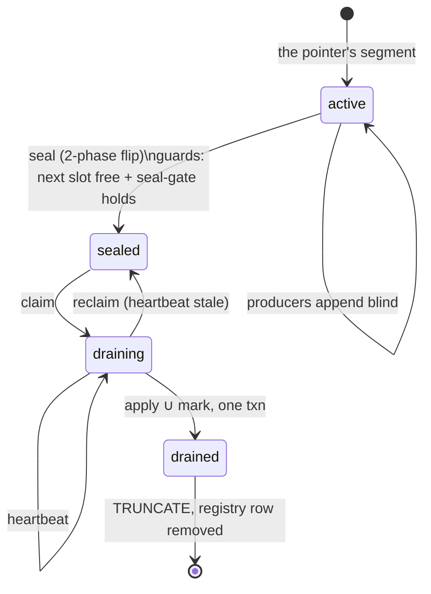

# Stage 3 — Sealing: turning an append stream into immutable batches

← [The staging ring](02-the-staging-ring.md) · next → [Claiming and the fold](04-claiming-and-the-fold.md)

**What this stage owns:** cutting the continuous append stream into immutable
batches, and proving every appended row belongs to exactly one.

**The guarantee:** *every staged row is claimed by exactly one batch — none in
two (a double apply), none in zero (lost work).* Both failure modes are silent,
so this is the part most likely to be got subtly wrong.

## The state machine



One function is the single source of truth for which edges are legal. Keep that
function; a state machine whose transitions are spread across call sites cannot
be reviewed.

## Why a naïve cut does not work

The instinct is: flip the pointer to a new slot, and declare the old slot a
complete batch. It is not:

> A writer may have read the pointer *before* the flip, and commit its insert
> into the old slot *after* the flip.

Call that row a **straddler**: physically in the sealed slot, but not there when
the seal happened. If the batch is "the rows in this table", the straddler is
applied twice or zero times — both silently.

You cannot fix this by locking the pointer — that is exactly the coordination
[02](02-the-staging-ring.md) refuses to pay for. So the batch boundary is defined
in **transaction-visibility space**, not table space.

## The fence

Every ring row carries `row_txid`, force-assigned by `DEFAULT txid_current()` —
the writer's real top-level transaction id. The seal captures a **transaction
snapshot** `S_k` onto the registry row. The batch is then:

> **Batch *k*** = the rows of `slot_k` **visible in `S_k`**, **plus** the rows of
> `slot_{k-1}` visible in `S_k` and **not** visible in `S_{k-1}`.

That is the **both-slots read**. The predecessor half picks up the straddlers
that batch *k−1* could not see.

Two properties fall out — the whole correctness argument:

- **Disjoint.** A row in `slot_j` is claimed by batch *j* iff visible in `S_j`,
  and by batch *j+1* iff visible in `S_{j+1}` and not in `S_j`. Both cannot hold.
- **Complete.** Their union is "visible in `S_{j+1}`", and the seal gate (below)
  guarantees every writer targeting `slot_j` is visible by the time `S_{j+1}` is
  captured.

Batch 0 has no predecessor: `S_{-1}` is empty, so every row of the first slot
qualifies.

### The scoping bug worth knowing about

The `NOT visible in S_{k-1}` clause must apply **only to the predecessor half**.
Applying it across both slots is the natural-looking simplification, and it loses
work: a writer that resolved the pointer between the flip's `COMMIT` and the
capture of `S_k` writes into the *new* slot and can commit before `S_k` is taken.
It is visible in `S_k` and belongs to batch *k* — but a uniform `NOT visible in
S_{k-1}` filter on the new slot does nothing, while batch *k+1*'s `NOT visible in
S_k` correctly discards it. Neither batch claims it; the slot truncates; the work
is gone.

Structurally: `slot_k` was scanned by no earlier batch, so it needs no
de-duplication; `slot_{k-1}` was scanned by batch *k−1* and needs exactly that.
Different slots, different clauses.

## The two-phase seal

The seal is **two transactions** — the split fixes the deepest hole in the naïve
version.

**Phase 1** (one transaction):
1. check the guards (below);
2. stamp `seal_step1 = txid_current()`;
3. finalize the segment's summary band from a single aggregate over its now-frozen
   table;
4. fill the **predecessor's** `seal_step2` with this flip's xid;
5. allocate the next `seg_seq` into the next slot as `active`;
6. flip the pointer — last;
7. `COMMIT`.

**Phase 2** (separate autocommit statements, after the flip has committed and is
visible):
1. set the pointer's mirror to the new slot (below);
2. bump the xid horizon (the `xmax` trap, below);
3. capture and record `seal_snapshot = S_k`.

**`seal_snapshot` must never be taken inside the flip transaction.** Taken after
the flip commits, no writer holding an old-pointer read can have an xid at or
above `xmax(S_k)` — which is what makes the fence sound. Taken inside, it can,
and the fence silently admits or drops rows depending on timing.

### The pointer writers read is a mirror

"No writer holding an old-pointer read has an xid at or above `xmax(S_k)`" makes
two assumptions about the writer. Its xid exists when it reads the pointer, and
the read returns the latest committed flip. At `READ COMMITTED` a plain
`SELECT` from `segment_pointer` meets the second. At `REPEATABLE READ` or
`SERIALIZABLE` it does not: the read answers from the transaction's snapshot,
which a first statement can have fixed any number of seals ago. Such a writer
lands in `slot_k` with `row_txid >= xmax(S_k)`. Batch *k* can't see it, the gate
for *k+1* doesn't wait for it, batch *k+1* misses it if `S_{k+1}` is captured
while it is still open, and no later batch reads `slot_k`. One seal between the
transaction's first statement and its first write is enough.

So writers never read the table. They read `ring_slot_mirror`, a sequence
holding the same slot, with `pg_sequence_last_value()`. Sequence reads are not
transactional, so the value is the latest one at every isolation level. The
same statement assigns the writer's xid first. Phase 2 sets the mirror
**after phase 1 commits and before the xid bump**, which restates the argument
for the mirror:

> A writer that read the old slot did so before the set, hence before the
> bump's xid was assigned, hence with an xid below `xmax(S_k)`. It is visible in
> `S_k` (batch *k* claims it) or in its in-progress list (the gate blocks
> `S_{k+1}` until it settles; batch *k+1* claims it).

Between phase 1's commit and the set, writers keep landing in the sealed slot.
That is the phase gap with the pointer's side of it moved, and the argument
covers it. `segment_pointer` stays the registry's authority: the seal's own
reads, `Raced`, and convergence read the table, since they run at
`READ COMMITTED`.

The set is guarded to the pointer still naming this seal's successor, with the
pointer row locked for the statement. A normal phase 2 always matches, because
the successor cannot seal before this fence is published. The guard is for a
phase 2 that stalls past the recovery age gate (below): recovery publishes
`S_k`, the successor seals and moves the mirror on, and the stalled call must not
drag the mirror back to a slot that is already sealed.

### The `xmax` trap

`txid_snapshot_xmax` is **not** "the next unassigned transaction id". Postgres
sets `xmax = latestCompletedXid + 1`, and the in-progress list holds only running
xids *below* that. A transaction whose xid was assigned but not committed — with
nothing above it completed — sits at or above `xmax` and is **absent from the
in-progress list**. The snapshot cannot distinguish it from a transaction that
does not exist yet.

That is exactly the straddling writer. It read the pointer as *k* and holds a
`slot_k` row, but if it is the highest xid around when `S_k` is captured then
`row_txid >= xmax(S_k)`: invisible in `S_k`, so batch *k* skips it — and the seal
gate `xmin(now) >= xmax(S_k)` is *already true* while it runs, so `S_{k+1}` is
captured without it and batch *k+1* skips it too. No batch folds the row, the
segment marks drained, and the slot is reclaimed.

The fix is one statement, run in autocommit immediately before the snapshot:

```sql
SELECT txid_current();   -- assigns an xid AND commits it, raising latestCompletedXid
```

Now `xmax(S_k)` is strictly above every xid assigned before it — hence above
every writer that read the pointer as *k*. Still-running such writers land in the
in-progress list: batch *k* skips them, the gate correctly **blocks** `S_{k+1}`
until they settle, and batch *k+1* claims them. One extra round trip per seal,
off the append path.

It only works in autocommit. Inside an open transaction the `SELECT` does not
commit and `latestCompletedXid` does not move.

### `seal_snapshot` is write-once

The phase-2 write is scoped `AND state = 'sealed' AND seal_snapshot IS NULL`, so
the first writer wins and `S_k` is immutable once published. Without that guard,
phase 2 could stomp a snapshot crash recovery had already reconstructed — two
unsynchronized writers to the published fence, meaning silent double-count or
loss. A raced phase 2 matches zero rows — a **benign no-op**.

> **Invariant:** `seal_snapshot` is written exactly once and never inside the flip
> transaction — a published fence, and a mutable one is corruption.

## The two guards — both are backpressure, never overwrite

A refused seal is always the correct outcome:

- **`RingFull`** — the next slot still carries a live registry row. Sealing would
  lap it and destroy un-applied work. Cleared by the cleanup pass removing that
  row ([06](06-cleanup-and-reclaim.md)), so a drainer that hits `RingFull` runs
  cleanup and retries the seal once. Without the retry, a ring full of
  drained-but-not-retired slots wedges the whole system.
- **The seal gate** — `xmin(now) < xmax(predecessor's S_k)` means a writer in
  flight at the previous seal has not yet committed or aborted. Advancing the
  epoch now could admit a straggler spanning **two** batch boundaries, outside
  the both-slots footprint. A predecessor whose `seal_snapshot` is not yet
  captured *holds* the gate until published — you can't prove settlement against a
  snapshot you can't read. A predecessor that doesn't exist does not.

A third outcome, **`Raced`**, means another worker sealed this active segment
first. The pointer read is a plain `SELECT`, so two idle workers can both plan a
seal; the row lock on the registry serializes the two `state = 'active'` updates
and the loser's `WHERE` matches zero rows. It backs off rather than inserting an
already-taken `seg_seq`.

## Who seals, and when

**There is no timer.** A worker that finds nothing claimable and sees rows in the
active segment seals it on demand, then retries the claim once. (This describes
the demand-driven sealing design, issue #272. Until that lands, the client's
maintenance loop still seals any non-empty active segment on its 300 ms tick,
through the same `seal_if_active_nonempty` guard.) The busy-loop
guard is structural: it seals only a *non-empty* active segment — **or** an empty
one whose predecessor still strands a phase-gap straggler (below) — at most one
seal per drain call.

### The phase-gap straggler this guard used to strand

The scoping bug above handles a phase-gap writer that lands in `slot_k` *before*
`S_k` is captured: batch *k* folds it in. A writer can also land in `slot_k`
**after** `S_k` is captured — it read the pointer as *k* under the plain unlocked
read, and a concurrent seal flipped the pointer away before its row committed.
Such a row can never be visible in the now-immutable `S_k`, so the only read that
folds it in is the successor's both-slots read — which runs only once `slot_{k+1}`
itself gets sealed.

If the ring goes quiet right after the straggler lands, the plain "non-empty"
guard never fires, `slot_k` reaches `drained` with the straggler still in it, and
nothing revisits the slot. The fix is the second seal condition above: an empty
active segment still seals when its predecessor holds a row not visible in that
predecessor's own fence. This is self-limiting — it fires only while the current
predecessor genuinely has such a row, so once folded in, the next predecessor no
longer qualifies.
[07](07-convergence-and-await.md)'s condition 3 is the matching half: a
`'drained'` slot owner does not, on its own, stop gating a row that was never
visible in its own fence.

Seal-on-demand is deliberate. A fixed cadence makes every small change wait for
the tick. Instead, **a batch is not a transaction** — it is everything appended
since the last on-demand seal, so a trickle seals immediately and a bulk workload
accumulates larger batches. Batch size adapts to load without a knob.

## Crash recovery: the one window that wedges

| Crash point | Left behind | Recovery |
|---|---|---|
| producer mid-append | nothing (rolls back with its transaction) | — |
| **sealer between phase 1 and phase 2**, including before the mirror set | `state = 'sealed'`, `seal_step1` set, `seal_snapshot` NULL, and possibly the mirror still naming the sealed slot, so writers keep landing there. The batch is unclaimable (a claim needs a snapshot) **and** its successor cannot seal (the gate blocks on the absent snapshot). **The ring wedges.** | a recovery pass runs phase 2 again: it sets the mirror, bumps, and reconstructs `S_k`. Every writer that landed in the sealed slot took its xid before recovery's bump, so the mirror argument holds unchanged. It is **age-gated** (10 s) so it can never stomp a healthy in-flight seal's sub-millisecond phase gap, and the write is scoped to the still-incomplete state, so a concurrent recoverer or a normal completion matches zero rows |
| sealer after phase 2 | complete seal | — |

Without the age gate, recovery races every normal seal — back to two
unsynchronized writers to the published fence.

## A deliberately-skipped case

A `sealed` batch with no snapshot is **skipped by the claim, not claimed
carefully.** It has no fence, so folding it would silently drop rows. Failing
loud on "sealed but unfenced" — rather than treating a missing snapshot as "admit
everything" or "admit nothing" — turns that crash window into a brief stall
instead of a data-loss event.

## What is load-bearing here

- **A per-row writer identity the store assigns**, not one the client supplies —
  `txid_current()` in a column default. The both-slots read depends on it.
- **Snapshot isolation with an inspectable snapshot.** Under "read committed" the
  both-slots read has no meaning; Trellis relies on `txid_snapshot`.
- **The two-phase split is not optional.** Capturing the boundary snapshot inside
  the transaction that moves the boundary is the `xmax` trap.
- **A snapshot-independent pointer read, after the writer's xid exists.** A
  writer at `REPEATABLE READ` or `SERIALIZABLE` reads a table from its
  snapshot, so it can be told a slot several seals old. Writers read the
  pointer from a sequence, whose reads are not transactional, and the seal
  sets that mirror before its xid bump.
- **The crash window is designed for, not discovered.** Phase 1 without phase 2
  wedges the ring on purpose, so the age-gated recovery pass is written alongside
  the seal.
- **The boundary is tested directly.** Named tests for the straddler, the
  phase-gap writer, the `xmax` case, and the snapshot-isolation writer — those
  four writers are the entire risk surface, and none appears unless a test
  deliberately holds a transaction open across a seal.
