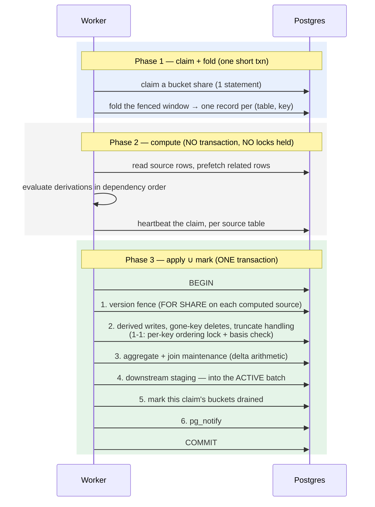

# Stage 5 — Applying, and why a delta lands exactly once

← [Claiming and the fold](04-claiming-and-the-fold.md) · next → [Cleanup and reclaim](06-cleanup-and-reclaim.md)

**What this stage owns:** turning folded records into derived writes, and doing
it in a way that survives crashes, duplicate execution, concurrent workers, and
concurrent definition changes.

**The guarantee:** *a non-idempotent effect — an aggregate delta — is applied
exactly once. Never twice, never zero times.* And it is guaranteed
**structurally**, with no per-key applied-marker to keep in sync.

## The three phases



**Phase 2 holds no locks and no transaction.** Deliberate: compute can be
arbitrarily expensive without blocking intake, another worker, or — by holding a
snapshot open — the seal gate and cleanup pass. The price is that the world can
move under you, which the version fence and the immutable batch exist to handle.

## The exactly-once argument

Three properties give it, and **all three are structural** — there is no
bookkeeping to keep in sync, no "applied" flag, no per-key watermark.

### 1. The claimed batch is immutable

A worker folds a *sealed* batch. No concurrent change can land in it: a source
change arriving mid-compute appends to the **active** batch and is a different
batch. There is no "a row changed under me" case to reconcile.

This includes the worker's own downstream staging: Step 4 appends into the
**active** batch, never onto the one being drained. A design where a worker can
stage into its own claimed batch loses the property immediately.

### 2. Apply ∪ mark-drained are one transaction

The derived writes, the aggregate maintenance, the downstream appends, and the
batch's `draining → drained` mark all commit together. This is why the target
store and the staging store are the same Postgres database: without a shared
transaction there is no exactly-once for non-idempotent effects.

- A crash **before** the commit rolls back the delta *and* the mark. The claim
  expires, the batch returns to `sealed`, and it re-drains from scratch.
- A crash **after** commits both.

Under a bucket claim the unit is the claimed *bucket set*: its apply, the deletion
of its claim rows, and the OR of its bits into the batch's coverage mask are the
same commit. The batch becomes `drained` exactly when the mask fills.

The completion statement does two jobs at once:

```sql
-- (1) the claim check and the mask are one act
DELETE FROM seg_claims WHERE seg_seq = :s AND claimed_by = :me RETURNING bucket;
-- an EMPTY result means "my claim was lost mid-drain" → raise → the whole
-- Phase-3 transaction rolls back → the current claimant re-drains it exactly once

-- (2) OR my buckets in; complete iff that fills every bucket
UPDATE segments
   SET drained_mask = drained_mask | :mask,
       state = CASE WHEN (drained_mask | :mask) = ((1::int8 << bucket_count) - 1)
                    THEN 'drained' ELSE state END
 WHERE seg_seq = :s AND state = 'draining';
```

### 3. The per-key fold telescopes

Within one batch, N changes to a key fold to one record whose old side is the
*earliest* pre-image and whose new side is the *latest* post-image. Across
batches, each batch's net delta chains onto the last: **batch *k*'s old side is
exactly the state batch *k−1*'s new side left.**

Because the deltas are invertible they also **commute**, so an out-of-order drain
converges to the same total.

## Absolute writes do not commute: the basis check

Batches drain out of `seg_seq` order, and key-routing does not order a key's
writes *across* batches ([04](04-claiming-and-the-fold.md)). The argument above
covers that for deltas only. Every write path has to be checked against this
table:

| Write kind | Commutes? | Idempotent? | What makes an out-of-order drain safe |
|---|---|---|---|
| Aggregate deltas (`+new − old`) | yes | **no** | exactly-once (the three properties above), plus the recompute horizon below whenever a group was also re-derived |
| Aggregate forced recomputes and extinction deletes (a live `GROUP BY` read) | **no** | yes | the recompute horizon, below |
| 1-1 field writes and deletes, from an image or a live recompute read | **no** | yes | the per-key ordering lock and basis check, below |
| Relationship projection writes | no | yes | the per-row `prev_lsn` ordering guard |
| Truncate | no | yes | the drain barrier (full serialization) |

A 1-1 write is an absolute value: "set this key's row to `f(row)`". Two such writes
for one key in two batches don't commute. If the batch computed from the older
source state reaches Phase 3 last, its value overwrites the newer one, and nothing
is left staged to correct it. That is the same **permanent staleness** the version
fence exists for, caused by ordinary data changes instead of a definition change
(issue #344). It needs no crash or retry to happen. It only needs one worker to
stall between Phase 2 and Phase 3, e.g. over a large catch-up batch.

So every 1-1 write and delete carries its **basis**: the source row it was
computed from (the staged image, or Phase 2's live read), or "no source row" for a
delete. Phase 3 applies it only if that basis is still the source's current state:

1. **The ordering lock.** Before writing any 1-1 target, Phase 3 takes a
   transaction-scoped advisory lock on every `(target, stripe)` its keys fall in,
   in ascending order. A stripe is the key's claim bucket (`route % 8`), so the
   workers draining one batch's buckets in parallel never contend. Only batches from
   different segments that share a bucket serialize. It can't be the target row's
   `FOR UPDATE` alone: a stale insert racing a delete has no row to lock.
2. **The basis check**, under that lock, in one statement: re-read each key's
   source row and compare. A write's basis holds if the current row contains
   every column of it with the same text (containment, since an image omits an
   unchanged TOASTed column). A delete's basis holds if the row is gone.
3. **A change whose basis no longer holds** is re-evaluated against the current
   row, when its definition reads no relationship: written if the row exists,
   deleted if not. Otherwise (or if evaluation fails) it is re-staged as a bare
   recompute, which a later batch reads live.

Why that converges: every Phase 3 for a key runs one at a time, and each one
writes only a value computed from the source's state *at that moment*. A source
change that commits after the check has a batch of its own still to come, and
that batch waits on the lock and then sees the change. So the last Phase 3 for a
key always writes that key's final state.

Re-evaluating instead of skipping matters for a hot key. If the source changes
faster than a batch drains, every batch's basis is stale by the time it applies.
Skipping would leave the target frozen until the key went quiet.

### Aggregate groups: the recompute horizon

An aggregate group can also receive an absolute write. An image-less change
(a catch-up enumeration, a chained hop's `Recompute`, a relationship fallback, a
truncate) has no prior state to diff, so Phase 3 re-derives the whole group from
a live `GROUP BY` read of the source. The delta path's existence probe is a live
read as well: when it finds the group empty, it deletes the group's row.

Either read can see a source commit whose own CDC delta has not been applied yet.
That delta may be in a later batch, in an earlier batch that drains later, in
another bucket of the same batch, or on the other side of a grain migration. When
it lands, it counts the commit a second time (issue #321). Ordering batches
cannot prevent this, because batches do not drain in order.

So the live read records its basis as a WAL position, and a delta checks it:

1. **The horizon.** The forced path's recompute statement also writes
   `pg_current_wal_insert_lsn()` into the group row's hidden
   `__trellis_recompute_lsn`. The function is evaluated while the statement runs,
   after its snapshot is taken. A commit visible to that snapshot wrote its
   commit record before it became visible, so its `end_lsn` (the `lsn` intake
   stamps on its ring rows) is at or below the stamped value.
2. **The extinct horizon.** A deleted row can't hold a horizon, so each batch
   whose live reads find a group empty raises its target's single row in
   `aggregate_extinct_horizon` to the insert position after those reads. That
   includes a group with no row to delete: its delta for this batch is dropped
   just the same, so the read may have absorbed a delete still in flight. A row
   that the delta path later creates starts with that value as its own horizon,
   since the empty group it grew from was the result of a live read too.
3. **The check.** The fold keeps each key's *earliest* image-bearing `lsn`
   (`min_image_lsn`). A folded delta telescopes every commit from that one to its
   latest. Under the pre-lock, each delta group compares that value against its
   row's horizon, or against the target's extinct horizon when it has no row. At
   or below, the delta may already be counted, so the group moves to the forced
   path and is re-derived. Above, the delta applies as usual. The check runs per
   group, so the two sides of a grain migration are judged against their own
   groups.

This is the same "re-evaluate, never skip" choice as the 1-1 basis check. An LSN
at or below the horizon only *may* have been read, so skipping the delta would be
unsound. Re-deriving is correct either way. The cost is that a group keeps being
re-derived while intake lags behind the apply and changes keep arriving for it.
In steady state that is a catch-up effect. A target reaches its readers through
one feed only, the seam (a relationship-endpoint target included, since issue
#375), so a chained aggregate sees no CDC for it at all. The horizon still
matters for one window: the upgrade that took endpoint targets out of the
publication, where CDC for an endpoint written before the drop still arrives
after the seam's `Recompute` for the same write.

The same rule covers a definition's inline enumeration at `DEFINE` time
(issue #322), which has no intake to wait on. The #312 watermark wait in
[01](01-intake-and-lsn-confirmation.md) is now an optimization that makes these
re-derivations rarer, not a correctness requirement.

## What this replaced

The old, mutable-worklist design needed two extra mechanisms, both now gone:

- An **`lsn` compare-and-delete**: clear a claimed key only if its `lsn` is
  unchanged since the claim, so concurrent re-stages survive.
- A **survivor rewrite**: when a re-stage *did* land on a claimed row mid-compute,
  advance that survivor's `old_image` to the image just applied, or the re-drain
  double-subtracts.

Both existed *only* because the worklist was mutable; Property 1 removes the race.
**A patch that reintroduces a mutable claimed batch must reintroduce them both** —
that is the tell for whether a proposed change is actually equivalent.

## The delta model

For a row with key `pk`, maintaining a measure `f` over group `g` in one Phase-3
transaction:

| Op | Effect |
|---|---|
| INSERT | `g(new) += f(new)` |
| DELETE | `g(old) -= f(old_image)` |
| UPDATE, grain unchanged | `g -= f(old_image)` and `g += f(new)` — one group, net delta |
| UPDATE, grain changed | **grain migration**: `g(old) -= f(old_image)` *and* `g(new) += f(new)` — two groups |

The drain needs exactly two facts per folded record: the **old-side image** (to
subtract; present iff `old_image IS NOT NULL`) and the **new-side image** (to
add; present iff the key is still live).

Folding the new side from the **staged post-image at the claimed position** — not
from a live source read — is what keeps the delta scan-free *and* closes a
read-ahead window: a live read at apply time can see a *later* state than the
batch is accounting for, and then the next batch subtracts an old image that was
never added.

Composite measures fold their hidden partials, never themselves: `avg` maintains
`{m}__sum` and `{m}__count` and recomputes the visible ratio from them.

**Not every measure is delta-able**; the gate is explicit: only exact, invertible
folds qualify. `count(*)`, `count(col)`, and `sum`/`avg` over
int/numeric are in. `min`/`max` are not invertible (removing the current maximum
tells you nothing about the next one) and take a probe-assisted recompute path
instead. Floats need care: naïve deltas drift unboundedly because IEEE-754
addition is non-associative, so the accumulator is kept in exact decimal and only
rendered to float — and `Inf`/`NaN` are tracked as counts, not delta-invertible at
all (`Inf − Inf = NaN`).

**The north star for the exact types is byte-identical convergence to a
from-scratch `GROUP BY` oracle after every op and every drain interleaving** — far
stronger than "eventually approximately right", and what makes the path auditable.

## The version fence: the one failure idempotency cannot fix

Idempotent recompute self-heals almost everything. It does not heal **permanent
staleness**: a stale in-flight write landing *after* a definition change's
re-derivation completes, with nothing left staged to correct it.

The design:

- **The definition applied is always the current one.** A staged change is pure
  identity ("recompute me"); logic is looked up fresh at compute time. Version the
  *catalog*, not the pending changes.
- **Per-source-table versions.** One monotonic version per source table. A
  definition change is one transaction scoped to the edited table: bump its
  version, write the new definitions, stage its affected keys, commit, notify.
- **The fence:** Phase 3 asserts every table it *evaluated* is still at the version
  it loaded — `FOR SHARE` on that table's meta row, which serializes against the
  definition change's `FOR UPDATE`. Mismatch → roll back, reload, recompute. No
  worker can commit values computed under a superseded definition, and an edit to
  one table never fences batches working on other tables.
- **Backstop:** the edit's re-derivation stages its rows at a higher position, so
  they land in a **later** batch than any in-flight drain's and cannot be swallowed
  by a batch already claimed.

The fence covers definition changes only. The same staleness caused by two
batches for one key draining out of order is closed separately, by the per-key
ordering lock and basis check ([above](#absolute-writes-do-not-commute-the-basis-check)).

**The fence runs first in Phase 3**, so a superseded batch rolls back before
touching a derived row. The fence set must include tables that are *evaluated* but
absent from the one-to-one write plan — an aggregate-only source, an equi-join
parent — or a grain change mid-batch slips through.

## Lock ordering, because parallel workers will overlap

Two workers whose batches touch overlapping aggregate groups will contend on the
same group rows. That is fine; deadlocking on them is not. Every statement that
writes group rows takes its locks in a **single consistent order — ascending
group key** — via an ordered pre-lock ahead of the write:

```sql
WITH locked AS (
  SELECT group_key FROM agg_target WHERE group_key = ANY(:groups)
  ORDER BY group_key FOR UPDATE
)
-- ... the actual merge, guarded so `locked` is genuinely referenced
```

A consistent total lock order has no cycle, so overlapping workers serialize on a
shared hot group instead of deadlocking. That plus a bounded, idempotent retry on
residual serialization failures (`40001`/`40P01`) is the whole deadlock story.

> **The same Postgres gotcha as the claim statement:** an unreferenced `FOR
> UPDATE` pre-lock CTE gets pruned and locks nothing. Force it with a `count(*)`
> guard in the outer query — this is an easy bug to ship and a silent one.

## Downstream propagation, and why it terminates

Step 4 stages the keys whose derived values depend on what just changed —
including, for a one-to-many aggregate, the parent groups of a changed child.
This is where the old-image requirement from
[01](01-intake-and-lsn-confirmation.md) is cashed in: a child **delete** or a
**re-parent** must refresh both the group the child joined (from the live row) and
the group it left (from the staged old image, which is the only place that
information still exists).

Two termination mechanisms:

- **Filtered staging.** Dependents are staged only for tables that actually have a
  derivation reading the changed table, so an acyclic dependency graph drains to
  empty. Cycles are rejected at definition time.
- **A schema-derived hop bound.** Each staged dependent carries a hop generation
  one past its deepest trigger (reset to 0 by any fresh source change — hence the
  `src_changed` OR rule in the fold). A wave climbing beyond the graph's
  cross-table depth plus slack cannot happen on the declared schema, so it raises a
  named error identifying the bound, the generation and the cycling tables.

An absolute round ceiling survives as defence-in-depth, catching runaways the hop
bound cannot (e.g. an unbounded stream of fresh intake). It is no longer the
contract, so its message stays hedged: exceeding it is *not* necessarily a cycle.

## Suppressing no-op writes

A source may feed several named derived tables, and a change usually affects only
one of them. The write carries a value-diff guard:

```sql
INSERT INTO target (...) VALUES (...)
ON CONFLICT (pk) DO UPDATE SET ...
 WHERE (target.a, target.b) IS DISTINCT FROM (EXCLUDED.a, EXCLUDED.b)
```

so a target a change did not affect sees no tuple churn. It is the relief valve
for hot tables, and what makes per-source (not per-target) version fencing free: a
sibling target's idempotent recompute writes nothing.

The set of keys **physically written** is then the "this recompute changed
something" signal that filters downstream propagation. Deleted keys count as
changed.

## Failure classification

Treating every Phase-3 failure uniformly turns a transient blip into a quarantined
key, or a schema error into a silently parked one. The classification:

| Class | Examples | Treatment |
|---|---|---|
| **Transient** | serialization/deadlock (`40001`/`40P01`), lock-not-available, statement timeout, dropped connection | retry; **charge nothing to any key** — a transient failure is not attributable |
| **Version fence miss** | a definition changed mid-drain | reload the schema and retry; back off on *consecutive* misses only |
| **Halting schema diagnosis** | a tripped hop bound (a real cross-table value cycle); a relationship endpoint that is not a source column | **propagate loudly**; never quarantine. Quarantining would convert a loud, actionable error into a key that blocks reads forever |
| **Ordering artefact** | a delta guard tripped while a lower-numbered batch is still outstanding | self-heals; charge only once every predecessor has drained |
| **Everything else** | a genuinely poisonous change | isolate and charge — see [06](06-cleanup-and-reclaim.md) |

The halting class deserves emphasis: **failing that way stops the whole instance,
deliberately.** The offending batch can never drain, cleanup requires every older
batch drained, so the ring fills and seals start failing. That is correct for a
genuine schema cycle — nothing may be silently skipped — but it is instance-wide
rather than scoped to the named tables, and the error message should say so. It
also needs a metric (counter plus last reason), because "stopped" and "slow" look
identical from outside otherwise.

## Invariants

1. **The claim is an optimization; the fence plus the atomic apply ∪ mark are the
   correctness mechanism.** A patch that makes correctness depend on claim
   exclusivity is wrong.
2. **The claimed batch is immutable.** Every producer writes to the *active*
   batch, including a worker doing downstream propagation.
3. **Apply and the drained mark are one commit**, per claimed bucket set.
   Splitting them reintroduces double-counting on the non-idempotent delta path.
4. **A row's bucket is a total function of the row and its batch** — no row in
   two buckets, none in zero.
5. **The fold's four rules are individually load-bearing.**
6. **Recompute reads committed current state and is deterministic.** A written
   value is never *wrong* — it is a deterministic function of the state that was
   read — only possibly *superseded*, and a later batch guarantees the superseding
   recompute runs. Parallelism costs some redundant recomputes, never a wrong
   final value. "Later" means later to *commit*, not later in `seg_seq`: for an
   absolute write, invariant 7 is what makes that true.
7. **A non-commutative write commits only if its basis is still current**, checked
   under a lock that serializes every Phase 3 for that key. A new write path must
   either commute (deltas), check its basis, or be serialized some other way
   (the `prev_lsn` guard, the truncate barrier). An aggregate group's absolute
   writes record their basis as a recompute horizon, and a delta that would
   commute with other deltas still has to check it
   ([the recompute horizon](#aggregate-groups-the-recompute-horizon)). See the
   classification table under
   [the basis check](#absolute-writes-do-not-commute-the-basis-check).
