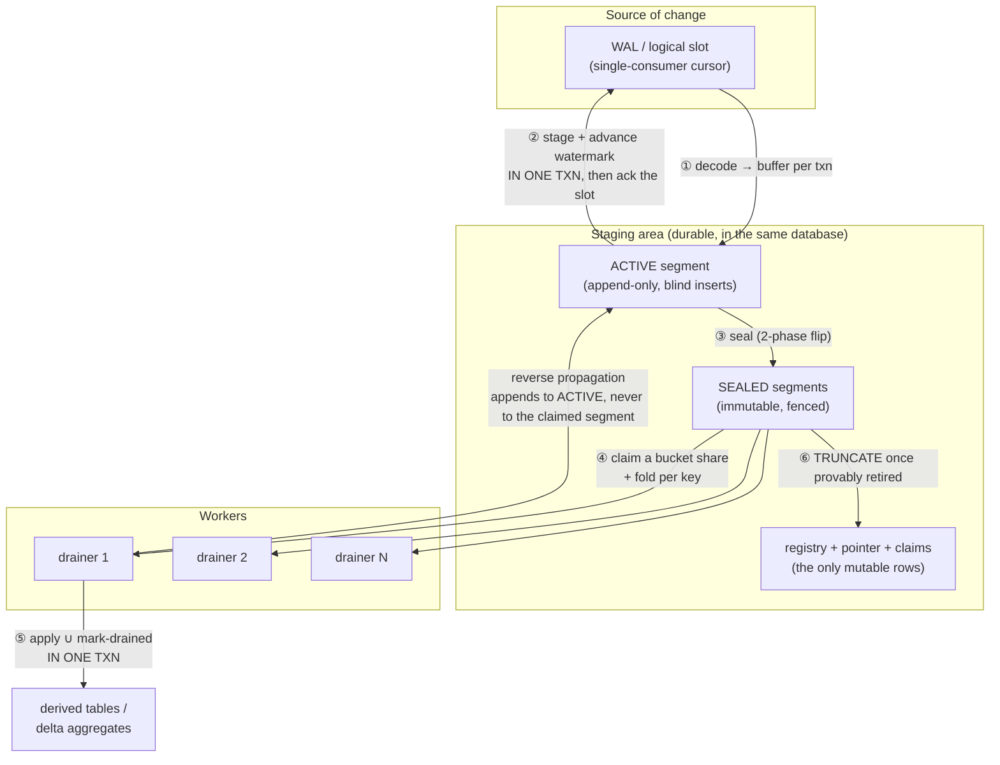

# Staging and Claiming

**What this is.** How Trellis gets a committed source-database change from the
write-ahead log into a derived table exactly once, with no window in which a
change is acknowledged but not durable. This series lays out the design — the
invariants and reasoning first, the SQL second.

## Where this fits in Trellis

Trellis's [data flow](../data-flow.md) describes this same pipeline at the
**logical** level — ingestion, batching, evaluation, chaining, quarantine, and
`await`. This series is the **physical** counterpart: the machinery that makes
that flow real, close to one-to-one. The
[async-data-flow decision](../decisions/0002-async-data-flow.md) records why
Trellis takes this path at all.

## The problem

You have a stream of committed changes and a set of workers that apply their
derived effects. Three things are simultaneously true and awkward:

1. **The stream has a single cursor.** A Postgres logical replication slot (like
   a Kafka partition offset or a MySQL binlog position) is a single-consumer,
   monotonic position. Acknowledging position *L* lets the server discard
   everything at or below *L* — acknowledge too early and the data is
   unrecoverable.
2. **Applying the effects is slow and wants to be parallel.** Recomputing derived
   values costs orders of magnitude more than decoding a change, so if the cursor
   advances only at apply speed, the log grows without bound whenever compute
   falls behind.
3. **Some effects are not idempotent.** A `sum` maintained by adding `+f(new)`
   and subtracting `−f(old)` is wrong if applied twice or zero times. Re-running
   it is not a safe repair.

The design resolves all three by **splitting acknowledgment from application**
with a durable staging area in between, then making that area's handoff to
workers structurally exactly-once rather than exactly-once by bookkeeping.

## The shape

Each numbered step has its own document:

| # | Stage | Document | The guarantee it owns |
|---|---|---|---|
| ① ② | Logical replication → staging, and the acknowledgment | [01-intake-and-lsn-confirmation.md](01-intake-and-lsn-confirmation.md) | The cursor never advances past work that is not durably staged. |
| — | The staging area's physical shape | [02-the-staging-ring.md](02-the-staging-ring.md) | Producers never block each other, and no hot-path row is ever updated. |
| ③ | Sealing: making a batch immutable | [03-sealing-and-the-fence.md](03-sealing-and-the-fence.md) | Every staged row belongs to exactly one batch — none in two, none in zero. |
| ④ | Claiming and the claim-time fold | [04-claiming-and-the-fold.md](04-claiming-and-the-fold.md) | Parallel workers partition a batch without a lock, and a key's changes collapse losslessly. |
| ⑤ | Applying, and non-idempotent deltas | [05-apply-and-exactly-once-deltas.md](05-apply-and-exactly-once-deltas.md) | A delta is applied exactly once — never twice, never zero times. |
| ⑥ | Cleanup, reclaim, and quarantine | [06-cleanup-and-reclaim.md](06-cleanup-and-reclaim.md) | Storage is bounded, and no cleanup step can retire un-applied work. |
| — | Proving it (read-your-writes) | [07-convergence-and-await.md](07-convergence-and-await.md) | A caller can block until its own write is reflected, and the predicate never lies. |
| — | Implementation checklist | [08-implementation-checklist.md](08-implementation-checklist.md) | What is essential to correctness, what is a Postgres-specific choice, what to test. |

A source `TRUNCATE` cuts across several of these stages (sealing, the fold, and
apply); its whole-keyspace-clear semantics and drain-ordering barrier are
written up separately in [truncate-propagation-spec.md](truncate-propagation-spec.md).

Four of these guarantees are correctness (intake durability, one batch per row,
claimed batches immutable, exactly-once deltas); each is enforced in exactly one
stage, and duplicating any of them is how the design rots.
Everything else — buckets, heartbeats, poison quarantine, truncate eligibility —
is liveness, throughput, or observability, never load-bearing for correctness.

## The state you have to keep

Seven durable objects; only three are ever `UPDATE`d, which lets the
high-volume ones be append-only and vacuum-free.

| Object | Mutability | Role |
|---|---|---|
| ring tables `seg_0 … seg_{N-1}` | **append + `TRUNCATE` only** | the staged changes themselves |
| `segment_pointer` | one row, updated per seal | names the active ring slot |
| `segments` (registry) | one row per live batch, updated | state machine, fence, bucket mask |
| `seg_claims` | one row per in-flight bucket | the claim; its primary key *is* the exclusion |
| `drainers` | one row per live worker | share denominator for fair fan-out |
| `replication_progress` | one row per slot | the durable acknowledgment watermark |
| `poison` / `poison_held` / `key_deaths` | per quarantined key | keeps a killer change from wedging the system |
| `transform_fuse_gate` | one row per poisoned source table | serializes concurrent evictions' fuse checks (issue #159) |

## Reading order

Read [01](01-intake-and-lsn-confirmation.md) → [02](02-the-staging-ring.md) →
[03](03-sealing-and-the-fence.md) in order; the fence in 03 does not make sense
without the append discipline in 02. [04](04-claiming-and-the-fold.md) and
[05](05-apply-and-exactly-once-deltas.md) are the worker half, best read as a
pair. [06](06-cleanup-and-reclaim.md) and [07](07-convergence-and-await.md) are
the operational half; [07](07-convergence-and-await.md) covers the
read-your-writes predicate, the easiest part of the design to get silently
wrong, so read it before designing the equivalent predicate.
